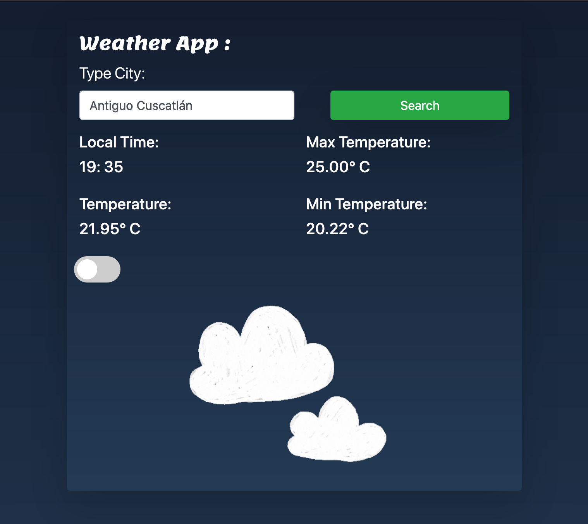
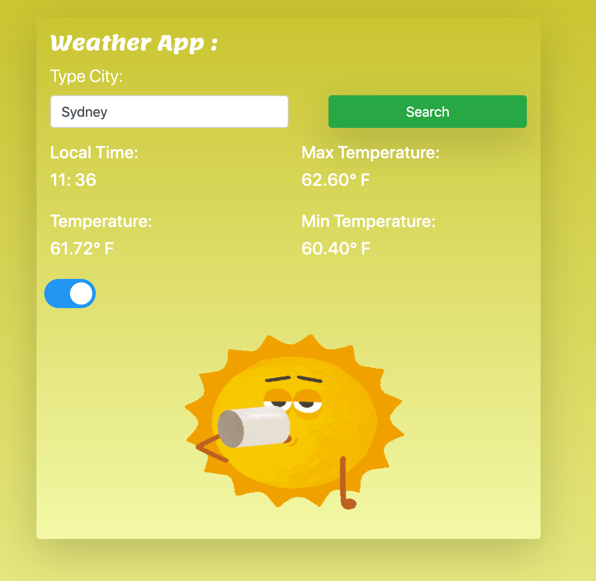
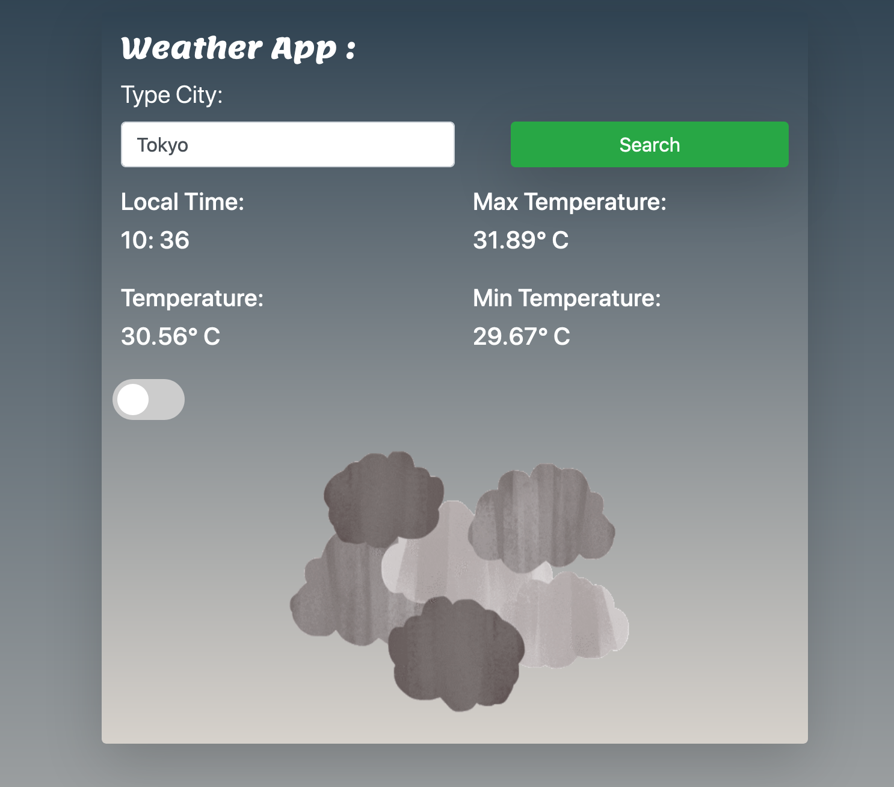

# Weather App

A Weather App/Time App

This Project uses Vainilla JavaScript with Webpack to make modularized JS, also this app consumes two APIS(OpenWeather,GIPHY) with fetch to be displayed on the app.

## Built with

- Javascript/ES6
- HTML5
- SASS
- Bootstrap
- Webpack

## Getting Started:

To get a local copy up and running follow these simple example steps:

1. Under the repository name, click the Clone or download green button.

2. Copy the URL given by clicking the clipboard button

3. Open a terminal window in your local machine and change the current directory to the one you
   want the clone directory to be made.

4. Type git clone and then paste the URL you previously copied to the clipboard

5. Run `npm install` to install node dependencies.

6. Run `npm run build` to launch webpack.

7. Open your web browser and then open the index.html local file that was copied to the proyect folder

## Show your support

Give a ⭐️ if you like this project!

## License

This project is [MIT] Licensed

## Author

👤 Fernando Rivas

- Twitter: [@ferm494](https://twitter.com/ferm494)
- Github: [@Ferm0494](https://github.com/Ferm0494)
- Linkedin: [@Ferm0494](https://www.linkedin.com/in/ferm0494/)
